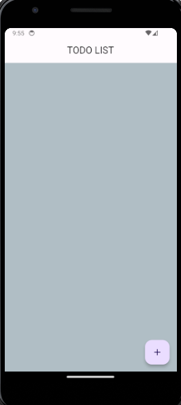
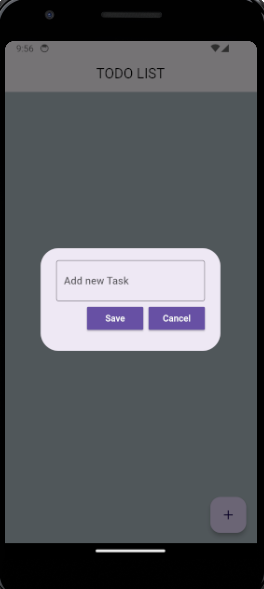
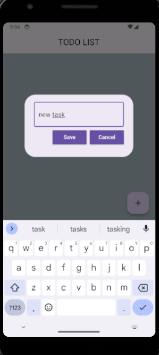
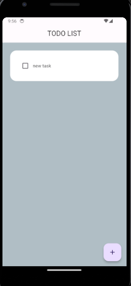
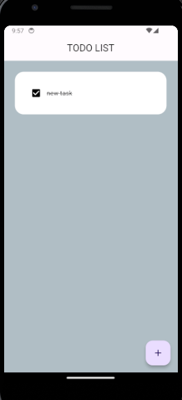
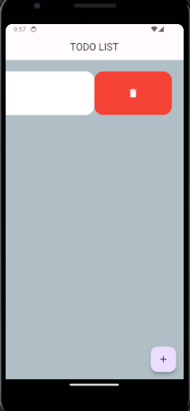
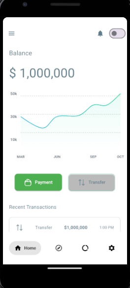
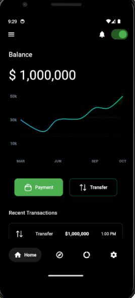
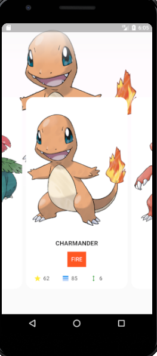
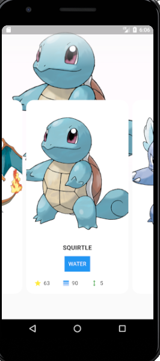

# Projetos

Todo List em Flutter - Aplicativo de Gerenciamento de Tarefas - todo_list

## Todo List em Flutter

### Descrição

O projeto "Todo List em Flutter" é um aplicativo de gerenciamento de tarefas que utiliza o framework Flutter para criar uma experiência de usuário fluida e intuitiva. Ele oferece funcionalidades essenciais para organizar tarefas, adicionar lembretes e marcar conclusões.

### Recursos Principais

- Interface de usuário atraente e responsiva, desenvolvida com Flutter.
- Adição, edição e exclusão de tarefas de maneira simples e eficiente.
- Marcação de tarefas concluídas para fácil acompanhamento.
- Salvando o estado da aplicação

### Tecnologias Utilizadas

- **Flutter:** Framework de desenvolvimento multiplataforma que permite a criação de aplicativos nativos para iOS e Android a partir de um único código-base.
- **Dart:** Linguagem de programação utilizada pelo Flutter para desenvolvimento de aplicações mobile.

Wallet - Aplicativo simulando uma Wallet - wallet

## Wallet

### Descrição

O projeto "Wallet" é um aplicativo que simula o template de uma carteira digital.
Foi utilizando uma arquitetura de pastas para separação do service da regra de negócio e da page. Utilizando a troca de tema dark e light utilizando o provider.

### Recursos Principais

- Interface de usuário atraente e responsiva, desenvolvida com Flutter.
- Temas Dark e Light.
- Gráfico representando as transações.
- listagem de transações.
- Menu de navegação.

### Tecnologias Utilizadas

- **Flutter:** Framework de desenvolvimento multiplataforma que permite a criação de aplicativos nativos para iOS e Android a partir de um único código-base.
- **Dart:** Linguagem de programação utilizada pelo Flutter para desenvolvimento de aplicações mobile.

Pokedex - pokedex (Ainda em construção...)

## Pokedex

 

### Descrição

O projeto "Pokedex" é um aplicativo que simula uma pokedex de pokemon, para treinar
os estilos e layout do flutter. Foi realizado a requisição na api da https://pokeapi.co/.

### Recursos Principais

- Interface de usuário atraente e responsiva, desenvolvida com Flutter.
- Carousel.
- Imagem do pokemon de fundo.
- Listagem de pokemons.
- Conexão com API.

### Tecnologias Utilizadas

- **Flutter:** Framework de desenvolvimento multiplataforma que permite a criação de aplicativos nativos para iOS e Android a partir de um único código-base.
- **Dart:** Linguagem de programação utilizada pelo Flutter para desenvolvimento de aplicações mobile.

Extract - extract

## Extract

 

### Descrição

O projeto "Extract" aplicativo baseado no desafio neste git: https://github.com/somosphi/desafio-android. Simulei o backend como esta inativo com dados mockados, criei utilizando bloc, compartilhamento, gerando pdf.

### Recursos Principais

- Interface de usuário atraente e responsiva, desenvolvida com Flutter.
- Listagem de transações.
- Bloc.
- Compartilhamento.
- Gerando arquivo PDF.

### Tecnologias Utilizadas

- **Flutter:** Framework de desenvolvimento multiplataforma que permite a criação de aplicativos nativos para iOS e Android a partir de um único código-base.
- **Dart:** Linguagem de programação utilizada pelo Flutter para desenvolvimento de aplicações mobile.

Provider - provider_estudos

## Provider

 

### Descrição

O projeto "Provider" aplicativo para mudança de temas utilizando o provider.

### Recursos Principais

- Interface de usuário atraente e responsiva, desenvolvida com Flutter.
- Mudança de temas.
- Provider

### Tecnologias Utilizadas

- **Flutter:** Framework de desenvolvimento multiplataforma que permite a criação de aplicativos nativos para iOS e Android a partir de um único código-base.
- **Dart:** Linguagem de programação utilizada pelo Flutter para desenvolvimento de aplicações mobile.

Todo Cubit - todo_cubit

## Todo Cubit

 

### Descrição

O projeto "Todo Cubit" aplicativo utilizando o Cubit para gerenciamento de estado.
Simulando uma implementação com api e utilizando o gerenciamento de estado.

### Recursos Principais

- Interface de usuário atraente e responsiva, desenvolvida com Flutter.
- Cubit para gerenciamento de estado.

### Tecnologias Utilizadas

- **Flutter:** Framework de desenvolvimento multiplataforma que permite a criação de aplicativos nativos para iOS e Android a partir de um único código-base.
- **Dart:** Linguagem de programação utilizada pelo Flutter para desenvolvimento de aplicações mobile.

Builder App UI - builder_app_ui (Falta a página de Templates)

## Builder App UI

 

### Descrição

O projeto "Builder App UI" aplicativo tirando como base este design https://dribbble.com/shots/23447398-Website-Builder-App-UI#. Foi desenvolvido a parte do Tema Dark e Light utilizando provider e simulando a integração com API.

### Recursos Principais

- Interface de usuário atraente e responsiva, desenvolvida com Flutter.
- Temas Dark e Light.
- Simulando a integração com API.
- Provider para gerenciamento de estado.

### Tecnologias Utilizadas

- **Flutter:** Framework de desenvolvimento multiplataforma que permite a criação de aplicativos nativos para iOS e Android a partir de um único código-base.
- **Dart:** Linguagem de programação utilizada pelo Flutter para desenvolvimento de aplicações mobile.

Math Game - math_game

## Math Game

 

### Descrição

O projeto "Math Game" jogo de Cálculo de Matemática estilo Puzzle, onde você vai avançando de levels com base no resultado do cálculo. Utilizei o Provider para gerenciar os estados e estou refatorando ainda o código. Esta bem divertido.
A Princípio terá 20 leveis gerados para diversão e a medida que vai passando de level o jogo marca o quanto você já progrediu.

### Recursos Principais

- Interface de usuário atraente e responsiva, desenvolvida com Flutter.
- Provider para gerenciamento de estado.

### Tecnologias Utilizadas

- **Flutter:** Framework de desenvolvimento multiplataforma que permite a criação de aplicativos nativos para iOS e Android a partir de um único código-base.
- **Dart:** Linguagem de programação utilizada pelo Flutter para desenvolvimento de aplicações mobile.

Quick Math - quick_math

## Quick Math

 

### Descrição

O projeto "Quick Math" jogo em desenvolvimento no qual é para resolver questões de matemática rápidas, no caso pequenos desafios. Estes desafios são gerados pelo sistema, lembrando que tem tempo, pontuação, ranking da melhor pontuação, sistema de cash para poder pular as perguntas caso tenha 5 de cash, sistema de tempo dependendo do tipo da pergunta e tudo mais.

### Recursos Principais

- Interface de usuário atraente e responsiva, desenvolvida com Flutter.
- Provider para gerenciamento de estado.
- Sistema de pontuação.
- Sistema de tempo de resposta dependendo da questão.
- Cash para poder utilizar para pular questões.

### Tecnologias Utilizadas

- **Flutter:** Framework de desenvolvimento multiplataforma que permite a criação de aplicativos nativos para iOS e Android a partir de um único código-base.
- **Dart:** Linguagem de programação utilizada pelo Flutter para desenvolvimento de aplicações mobile.

Tetris - tetris_game

## Tetris

 

### Descrição

O projeto "Tetris" jogo de Tetris com a movimentação dos Tetrominos, giro e pontuação quando preenchido toda a linha.

### Recursos Principais

- Interface de usuário atraente e responsiva, desenvolvida com Flutter.
- Sistema de pontuação.
- Sistema de giro com base no Tetromino.
- Sistema de criar o Tetromino com base no seu formato.

### Tecnologias Utilizadas

- **Flutter:** Framework de desenvolvimento multiplataforma que permite a criação de aplicativos nativos para iOS e Android a partir de um único código-base.
- **Dart:** Linguagem de programação utilizada pelo Flutter para desenvolvimento de aplicações mobile.

